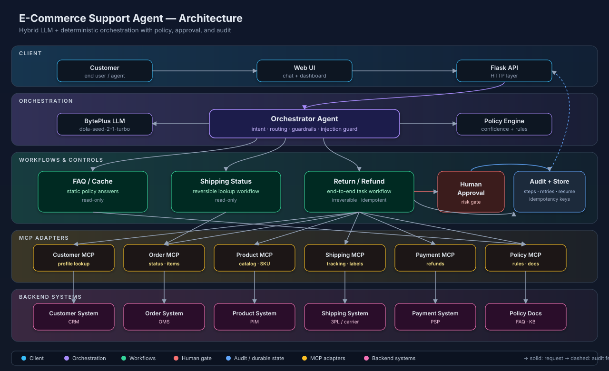

# E-Commerce Support Agent Demo

Standalone hybrid demo project for an electronics e-commerce customer support agent.

## Architecture



See [docs/solution-diagram.md](docs/solution-diagram.md) for the Mermaid source and a reading guide.

## Features

- Configurable LLM-assisted support flow with Jev for intent decisions and BytePlus chat for customer-facing response generation
- Deterministic orchestrator routes user requests to FAQ, shipping-status, or return/refund workflows
- Mocked MCP-style systems for customer, product, order, shipping, payment, and policy
- Reversible read-only actions separated from irreversible mutations
- Human approval gate for high-risk or policy-sensitive refund flows
- Durable workflow and audit persistence for resumability
- Idempotency keys for refund, return-label, and order-update actions
- Retry ceilings, step ceilings, prompt-injection guard, circuit-breaker state, and human handoff
- Dashboard for chat, approval queue, audit trail, workflow metrics, and system health

## Environment

Create and fill `.env`:

```env
DECISION_PROVIDER=jev
REPLY_PROVIDER=byteplus

TYPESAFE_API_KEY=your_typesafe_api_key
TYPESAFE_MODEL=jev-latest

ARK_BASE_URL=https://ark.ap-southeast.bytepluses.com/api/v3
ARK_API_KEY=your_byteplus_api_key
ARK_ENDPOINT_ID=your_endpoint_id
ARK_MODEL=dola-seed-2-1-turbo-260628
ARK_THINKING_MODE=disabled
ARK_TIMEOUT_SECONDS=60
```

Notes:

- `.env` is ignored by git.
- The Jev path is used only for intent classification when `DECISION_PROVIDER=jev`.
- Customer-facing reply generation stays on the BytePlus chat path when `REPLY_PROVIDER=byteplus`.
- The app prefers `ARK_ENDPOINT_ID` when provided for the BytePlus reply model.
- If `ARK_ENDPOINT_ID` is empty, it falls back to `ARK_MODEL`.
- `ARK_THINKING_MODE=disabled` is recommended for this demo to reduce latency.
- Neither TypeSafe nor BytePlus credentials are ever included in prompts, workflow state, or UI payloads.
- Do not commit `.env`; keep provider keys only in local environment configuration.

## Run

```bash
cd /Users/bytedance/aidemo/ModelArkDemo/EcommerceSupportAgentDemo
python3 -m venv .venv
source .venv/bin/activate
pip install -r requirements.txt
python app.py
```

Open [http://localhost:13001](http://localhost:13001).

If `.env` is not filled yet, the app still runs with deterministic fallback behavior.

## Demo Prompts

- `What is your refund policy?`
- `Where is order ORD-1002?`
- `I want to return order ORD-1001. It is still sealed.`
- `Refund order ORD-1004. The laptop has issues.`
- `Return order ORD-1003 please.`
