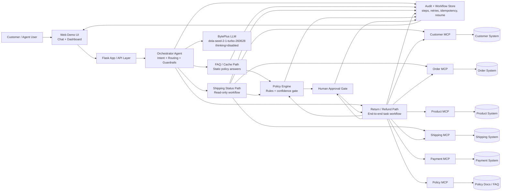

# E-Commerce Support Agent Solution Diagram

## Reading Guide

- `Customer -> UI -> API -> Orchestrator` is the main request path.
- The orchestrator uses the `BytePlus LLM` only for intent understanding and response wording.
- `FAQ / Cache Path` handles simple static questions without hitting backend systems when possible.
- `Shipping Status Path` is a reversible, read-only workflow.
- `Return / Refund Path` is the full task workflow with policy checks, MCP lookups, approval gating, and irreversible actions.
- `Policy Engine` applies confidence thresholds, policy checks, retry ceilings, and safe fallback logic.
- `Human Approval Gate` is used before risky irreversible actions when policy or confidence requires it.
- `Audit + Workflow Store` records workflow IDs, step IDs, retries, idempotency keys, and supports resume after failure.
- Each business domain is isolated behind its own `MCP`, which then connects to its own backend system.
